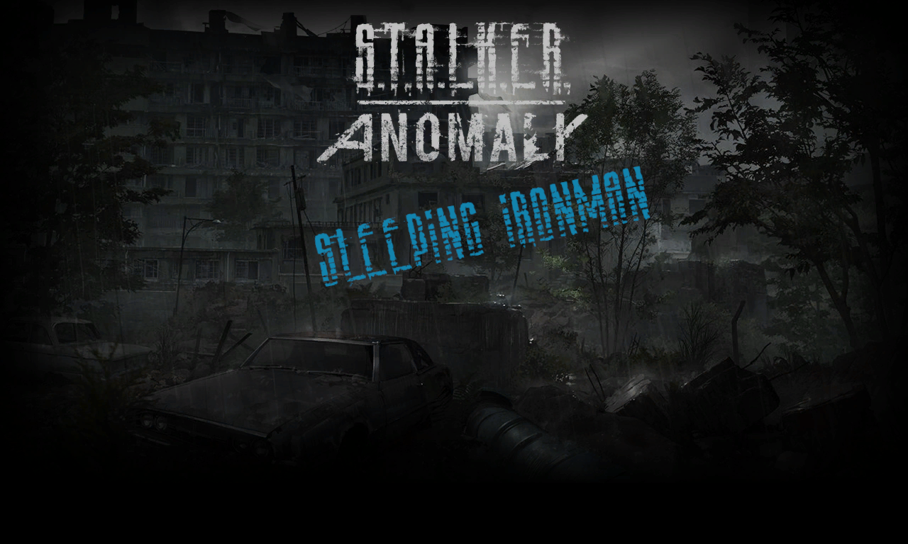

Sleeping Ironman - Anomaly 1.5.3
--------------------------------

Adjusts Ironman mode to count time spent sleeping toward earning a new life. The portion of sleep time that contributes to a new life is configurable (see configuration section) and defaults to 50%.

### Installation

#### JSGME:

Copy the `Sleeping Ironman` folder to your `MODS` folder and enable it through JSGME.

#### Manual:

Copy the contents of `Sleeping Ironman/gamedata` folder to your `gamedata` folder.

### Configuration

#### Using Mod Configuration Menu (MCM)
The mod is compatible with [MCM](https://www.moddb.com/mods/stalker-anomaly/addons/anomaly-mod-configuration-menu), therefore you can simply install the mod and configure it through the MCM as usual by selecting "Sleeping Ironman" menu.

#### Without Mod Configuration Menu (MCM)
The mod can be configured by adjusting default values in the included script file:

1. Open `Sleeping Ironman/gamedata/scripts/sleeping_ironman_mcm.script` in a code editor.
2. Find the `defaults` table at the top of the file. 
3. Configure the mod by modifying the desired values (see details below).
4. Save changes and install the mod.

#### Details

- `sleep_percent` - Percentage of hours asleep that count as being awake. For example, with a setting of 0.5, sleeping for 12 hours counts the same as 6 hours of awake time. 
  - `Acceptable values`: between `0.05` and `1.0`.
  - `Default`: `0.5`.
  - The old **Half Sleep** variant used the value `0.5`. 
  - The old **Full Sleep** variant used the value `1.0` meaning that 100% of hours slept would count toward earning a new life.
- `limit_lives` - Limits maximum number of lives. Additional lives past `max_lives` value are not granted.
	- `Acceptable values`: `true` or `false`.
	- `Default`: `false`.
- `max_lives` - Additional lives past this value are not granted. Works only when life limit is enabled.
	- `Acceptable values`: between `1` and `1000`.
	- `Default`: `3`.

### Feedback

I would love to hear your feedback on the "feel" of the game. A sleep percentage of `0.5` combined with a life limit retains the original tension and atmosphere while offering a second chance after a rare slip-up or unfortunate circumstances.

### Related mods:

* [Immersive Sleep](https://www.moddb.com/mods/stalker-anomaly/addons/immersive-sleep) by tkcrits

### Old versions
- Anomaly 1.5.2 - current version is fully compatible.
- Anomaly 1.5.1 - [Release on GitHub](https://github.com/dino8890/sleeping-ironman/releases)

### Screenshot

